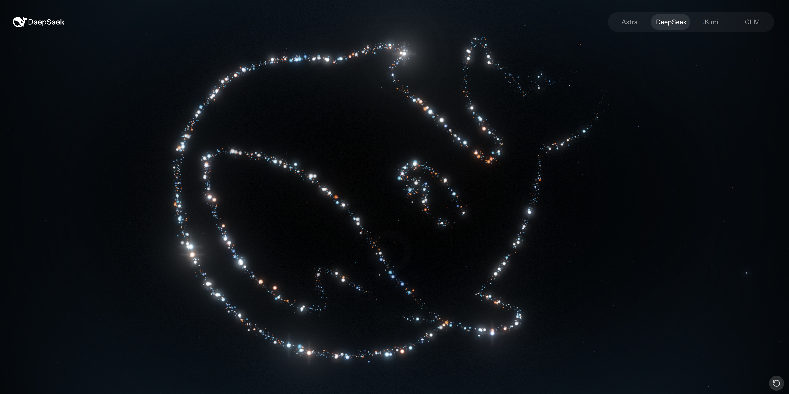
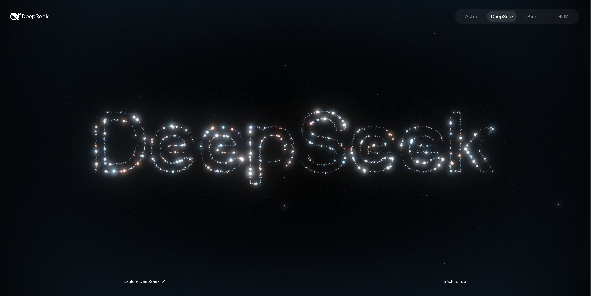
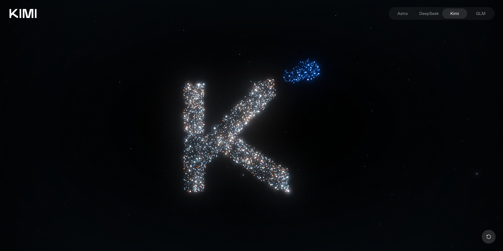
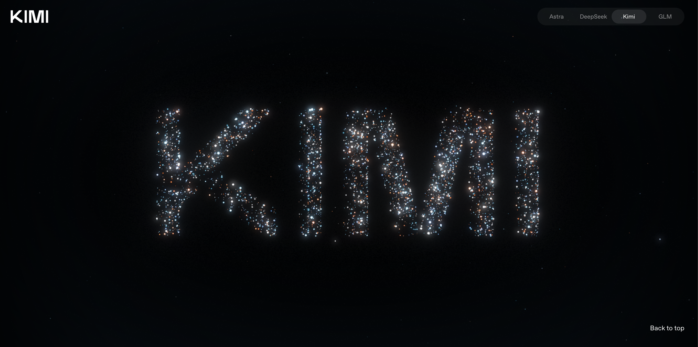
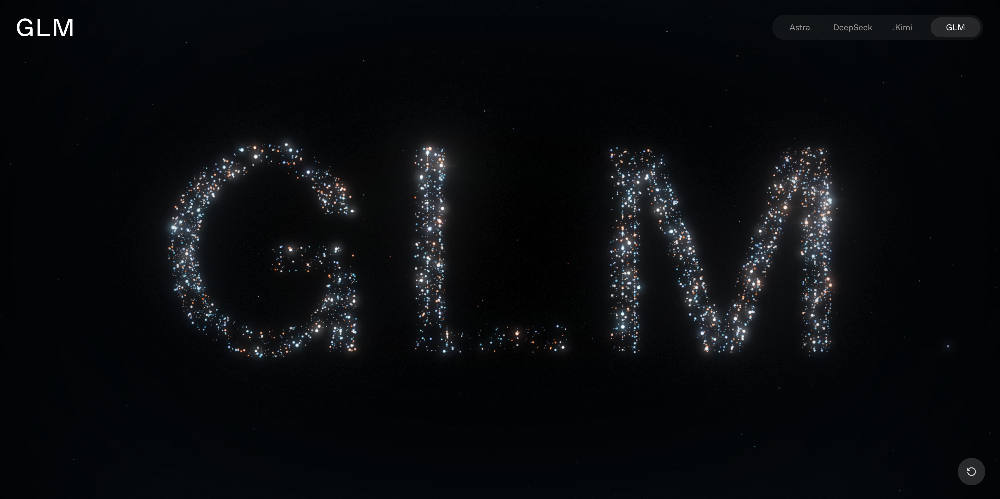
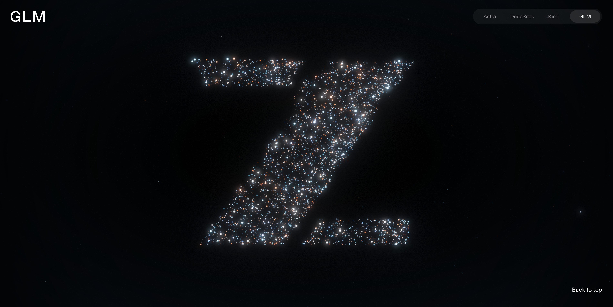
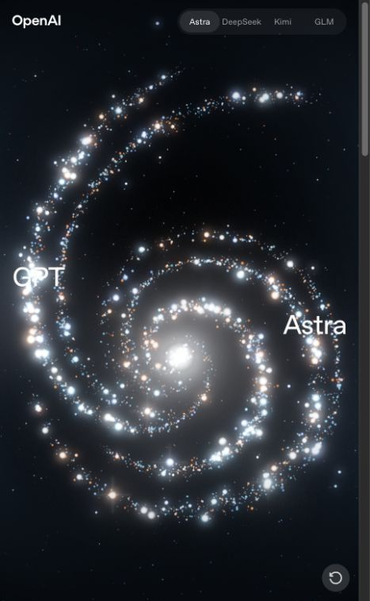
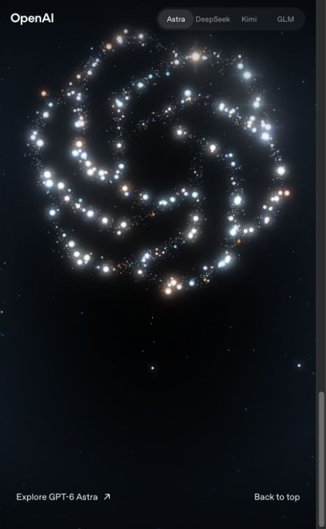

# Particle Showcase

让 Logo 在星光中成形，随鼠标、拖拽和滚动散开、旋转、再次聚合。

基于 **React + TypeScript + Vite + Three.js** 的交互粒子展示项目，包含四套品牌示例和配套 Agent Skill。页面、形状数据与渲染器分层组织，便于阅读、调整和接入自己的作品。

[效果预览](#效果预览) · [快速开始](#快速开始) · [下载 Skill](https://github.com/Hello-job/particle-showcase/releases/latest/download/particle-showcase-skill.zip) · [定制指南](docs/customization.md) · [核心代码](src/particles/core/README.md)

## 效果预览

以下为本项目的实际浏览器截图。DeepSeek、Kimi、GLM 使用保留原分辨率的 PNG 图片，点击可查看原图。每种模式从首屏图形出发，随滚动散开，再聚成底部星座；运行项目后可以体验鼠标扰动、拖拽和重播。

### DeepSeek

**首屏 · 鲸鱼**



**底部 · DeepSeek 字标**



### Kimi

**首屏 · K 与蓝色水滴**



**底部 · KIMI 字标**



### GLM

**首屏 · GLM 字母**



**底部 · Z.ai 三段图形**



<details>
<summary>Astra 原版示例</summary>

**首屏 · 螺旋 6**



**底部 · OpenAI 结形**



</details>

## 体验

- **真实粒子渲染**：本地 WebGL 场景，保留星点、光晕、聚合和散开动画。
- **连续交互**：鼠标扰动、拖拽旋转、方向键控制、滚动变形与重播。
- **四套示例**：统一的品牌切换、简洁页头、桌面和窄屏布局。
- **可替换形状**：支持 SVG 轮廓、填充形状、字母内部留白、分离部件和局部配色。
- **轻量 Skill**：直接使用仓库源码，附项目导出脚本、接入说明和验证清单，不重复携带应用与素材。

| 模式     | 地址参数          | 首屏                 | 底部                       |
| -------- | ----------------- | -------------------- | -------------------------- |
| Astra    | `?shape=astra`    | 螺旋 6               | OpenAI 结形，中间包含光标  |
| DeepSeek | `?shape=deepseek` | 鲸鱼轮廓             | 定制大小写 `DeepSeek` 字标 |
| Kimi     | `?shape=kimi`     | K 标志与独立蓝色水滴 | 完整 KIMI 字标             |
| GLM      | `?shape=glm`      | GLM 字母             | 去除外框的 Z.ai 三段图形   |

默认模式为 DeepSeek。示例模型名称是 2026-09-06 的文案快照，手动维护，不作为实时型号列表。

## 快速开始

需要 **Node.js 22.13+**、**pnpm 11.17.0**，以及支持 WebGL 的现代浏览器。pnpm 版本固定在 `package.json` 的 `packageManager` 字段中。

```bash
git clone https://github.com/Hello-job/particle-showcase.git
cd particle-showcase
pnpm install --frozen-lockfile
pnpm dev
```

打开终端显示的本地地址，使用右上角切换模式。粒子、字体和图形资源均在本地；首次安装依赖需要网络。

```bash
pnpm check
pnpm build
```

`pnpm check` 包含 TypeScript 类型检查、ESLint、格式检查和测试。普通生产构建输出到 `dist/`，运行 `pnpm preview` 可预览构建结果。

可选的 Sites 适配独立保留，需要时执行 `pnpm build:sites` 与 `pnpm test:sites`；对应产物位于 `dist/client/`、`dist/server/` 和 `dist/.openai/`。

## 目录

```text
src/
├── app/                  # 页面组合与入口逻辑
├── components/showcase/  # 页头、形状锚点和交互控件
├── config/               # 展示配置与类型
├── particles/
│   ├── ParticleBackground.tsx
│   ├── engine/           # TypeScript 场景接入与类型边界
│   ├── shapes/           # SVG 几何、注册表与采样
│   └── core/             # 可读 TypeScript 粒子、动画、渲染和着色器
├── styles/               # 页面与粒子背景样式
└── main.tsx
public/assets/            # 本地图形与字体
docs/                     # 架构、定制、Skill 和历史视觉记录
skills/particle-showcase/ # Skill 指南、参考与项目导出脚本
scripts/                  # 构建适配与 Skill 检查、打包
tests/                    # 行为与构建检查
deliverables/             # 可分发的 Skill ZIP
worker/                   # 可选 Sites 适配
```

React 组件使用 `.tsx`，粒子核心和其他逻辑使用 `.ts`。`particles/core/` 将提取的编译模块整理为普通导入、明确命名和结构类型；GPU 着色器保留为 GLSL 源码。原始编译版本保存在 Git 标签 `typescript-showcase-v1`，不参与当前运行或 Skill 分发。这是有来源记录的重构，不能称为找回原作者源码。详见[架构与数据流](docs/architecture.md)和[粒子核心阅读指南](src/particles/core/README.md)。

## 下载与使用 Skill

**[下载 Particle Showcase Skill ZIP](https://github.com/Hello-job/particle-showcase/releases/latest/download/particle-showcase-skill.zip)** · [备用下载](https://github.com/Hello-job/particle-showcase/raw/refs/heads/main/deliverables/particle-showcase-skill.zip) · [查看 Skill 源码](skills/particle-showcase/)

1. 下载 ZIP，将其中整个 `particle-showcase` 文件夹解压到 `~/.codex/skills/`。设置了 `CODEX_HOME` 时，放到 `$CODEX_HOME/skills/`。
2. 克隆本仓库，或在 GitHub 点击 **Code → Download ZIP** 后解压源码。
3. 重新打开 Agent 任务，在源码目录内调用 `$particle-showcase`；也可以告诉它源码的本地路径。

**Skill 是轻量指南与工具包，不包含粒子引擎或素材副本。** 它直接使用本仓库的代码，因此安装 Skill 后仍需一份仓库源码。

```text
使用 $particle-showcase，把我的 SVG Logo 做成互动粒子页面。
粒子源码就在当前仓库。
首屏展示 Logo，底部聚成品牌英文，保留鼠标、拖拽、滚动和重播。
```

也可以从本地源码导出独立项目：

```bash
python3 skills/particle-showcase/scripts/create_showcase.py \
  --source . \
  --dest ../my-particle-page \
  --brand kimi \
  --title "My Model" \
  --single-brand
```

创建脚本需要 Python 3.9+，目标须为新目录或空目录。导出后在新目录中运行 `pnpm install --frozen-lockfile` 和 `pnpm dev`，项目即可独立运行。

完整步骤见 [Skill 安装与使用](docs/skill/usage.md)，包维护见 [Skill 开发说明](docs/skill/development.md)。

## 定制自己的形状

从 `src/config/showcase.json` 调整品牌信息、默认模式和标题。新增 Logo 时，把 SVG 轮廓放入 `src/particles/shapes/`，在注册表中添加形状，再指定首屏与底部目标。

[定制指南](docs/customization.md)介绍轮廓与填充采样、文字内部留白、分离配色和滚动节奏；[架构说明](docs/architecture.md)解释页面、输入和渲染器如何协作。提交改进前请阅读[贡献说明](CONTRIBUTING.md)。

## 来源与许可状态

粒子渲染器移植自 [OpenAI GPT-6 Astra 页面](https://openai.com/index/gpt-6-astra/)，本项目增加了独立页面、品牌形状、工程组织和 Skill。它不是 OpenAI、DeepSeek、Moonshot AI 或 Z.ai 的官方项目。

**仓库尚未选择统一的开源许可证。** 原始渲染代码、字体与品牌素材保留各自来源，本仓库不对它们授予新的许可。公开展示源码与授予开源许可是两个独立步骤；当前状态见 [LICENSE.md](LICENSE.md)，具体素材见[第三方来源说明](THIRD_PARTY_NOTICES.md)。

本轮检查见 [可读核心验收](docs/verification/readable-engine.md)，前一轮页面迁移见 [TypeScript 重构验收](docs/verification/typescript-migration.md)。历史截图与视觉验收在 [docs/archive](docs/archive/README.md)，各阶段 Git 标签保持可回退。
